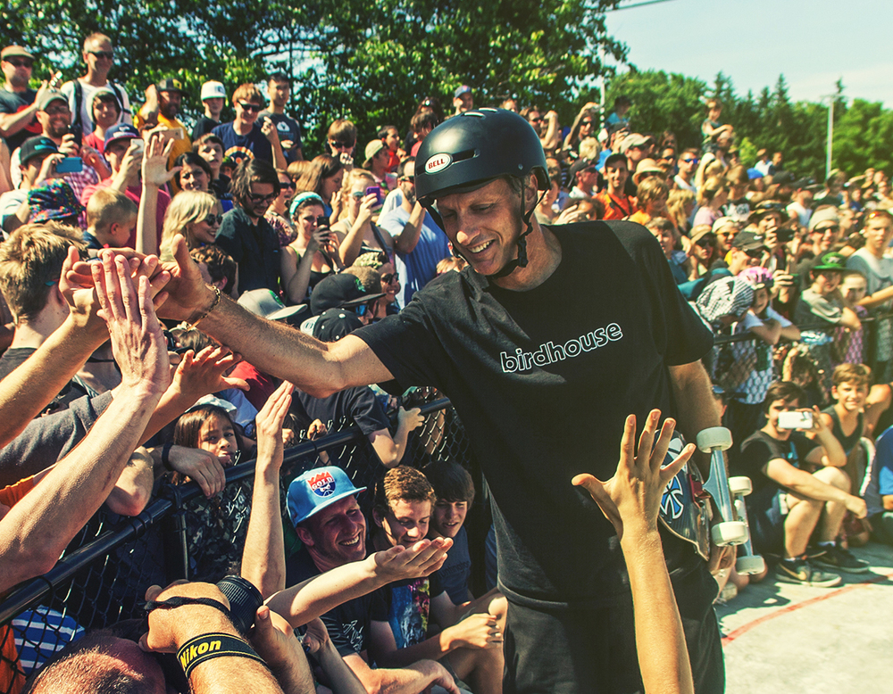
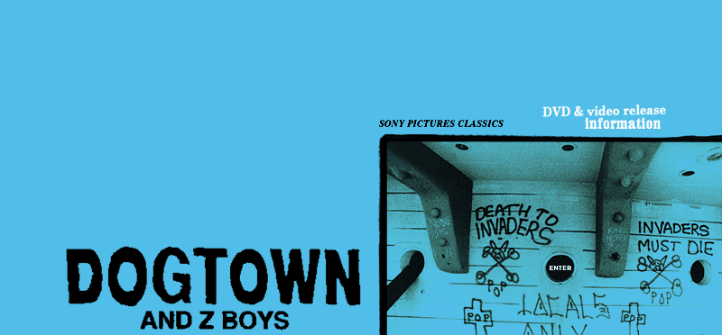

# Let's skateboarding

以下内容包含，滑板的历史和资料，请在板友的陪同下浏览。

「 [http://www.skatevideosite.com](http://www.skatevideosite.com) 」是世界上最大的，关于滑板的视频网站。你可以看到，喜欢的明星滑板运动员的表演。

「 [http://docs.huihoo.com/homepage/shredderyin/sk8_frame.html](http://docs.huihoo.com/homepage/shredderyin/sk8_frame.html) 」是垠神的个人主页，关于对滑板至诚的热爱。

Tony Hawk，在1999年，创造了空中转体900，是一个传奇。「 [http://www.tonyhawk.com/](http://www.tonyhawk.com/) 」

20世纪70年代中期，滑板运动形成了独特的运动精神。西风少年（z-boy）横空出世，将滑板运动带到了全世界。「 [http://www.sonyclassics.com/dogtown/](http://www.sonyclassics.com/dogtown/) 」，Dogtown。

滑手日记，一部关于中国职业滑手的纪录片。「 [http://www.vice.cn/show/skater-diary](http://www.vice.cn/show/skater-diary) 」故事发生在2016年，表达五位板仔与滑板的故事，他们分别是：许莹，黑柴，王汇丰，香蕉，Dan Leung。
